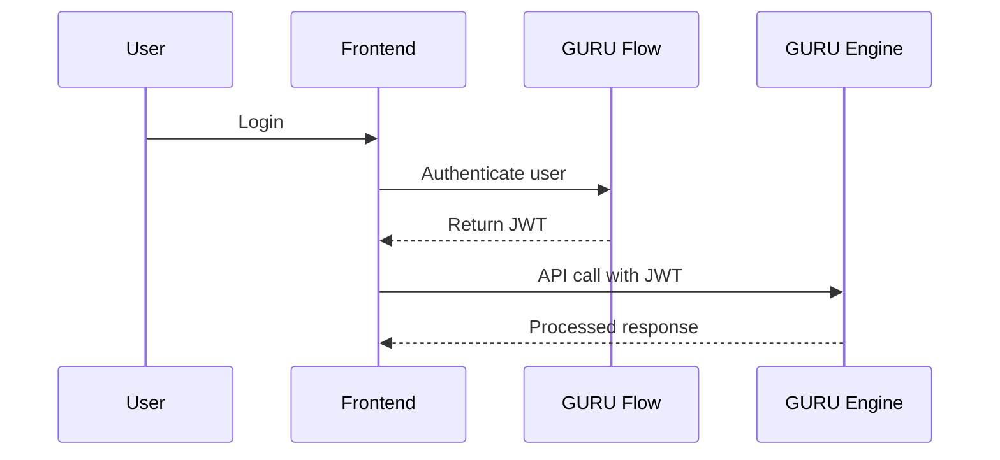
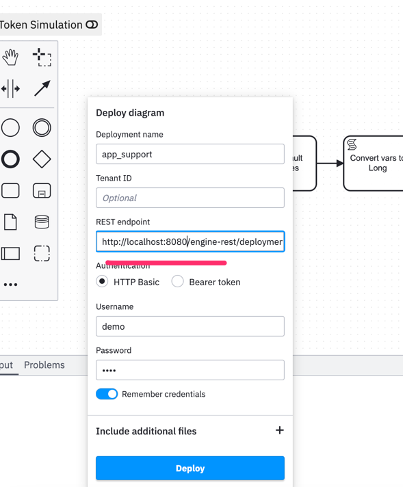

# Guru Framework · **Engine Module**

> **Status:** Alpha · Actively developed · Contributions welcome
> The Engine module is the **workflow & event-streaming heart** of the Guru Framework. It fuses [Camunda Platform 7](https://camunda.com/products/camunda-platform/) with AI processors, on-chain triggers, and a high-throughput AMQP event bus—exposing everything **only** through **REST** and **WebSockets**.

---

## 🧠 What is the GURU Engine?

The **GURU Engine** is the workflow and event-processing core of the GURU Framework.
It orchestrates business processes, AI tasks, and blockchain events using [Camunda Platform 7](https://camunda.com/products/camunda-platform/) as its foundation, and exposes all functionality via secure REST and WebSocket APIs.

**Why does it exist?**
- To provide a **central, auditable, and extensible workflow engine** for the GURU ecosystem.
- To connect on-chain events, AI/ML processors, and user-facing apps in a single, event-driven architecture.
- To enable rapid integration and automation across all GURU Framework components (GURU Flow, Frontend, Analytics, etc).

---

## 🔐 JWT Authentication: Secure, Pluggable Integration

The GURU Engine uses **JWT (JSON Web Token) authentication** to securely connect with other components of the GURU Framework, such as:

- **GURU Flow** (Python FastAPI): Issues JWTs for users and services.
- **Frontend** (Next.js, React, etc): Passes JWTs to the Engine for user actions and workflow triggers.
- **Other microservices**: Can authenticate and interact with the Engine using JWTs.

### How it works

1. **JWT Issuance**:
   - GURU Flow (or another trusted auth service) issues a JWT after authenticating a user or service.
   - The JWT contains user identity and claims (e.g., email, roles, isActive, isVerified).

2. **JWT Verification in Engine**:
   - Every API request to the Engine must include the JWT in the `Authorization: Bearer ...` header.
   - The Engine verifies the JWT signature and claims using a shared secret (configured via environment or YAML).
   - If the JWT is valid, the Engine automatically creates the user (if not present) and assigns them to the appropriate group (e.g., `camunda-admin`).

3. **Seamless Integration**:
   - Any component (GURU Flow, Frontend, etc) can interact with the Engine by presenting a valid JWT.
   - This enables **single sign-on** and **fine-grained access control** across the entire GURU ecosystem.

#### Example JWT Auth Flow



---

## ✨ Key Capabilities

| Capability | Description |
|------------|-------------|
| **BPMN 2.0 Runtime** | Executes standard BPMN diagrams with user tasks, timers, DMN, and incident handling. |
| **External Workers** | Language-agnostic job clients (Java / Python / Node) pull work via REST—ideal for GPT calls or on-chain interactions. |
| **Engine Event Bus (AMQP)** | Every history/event is serialised to JSON and published to **RabbitMQ/Kafka** for reactive UIs & data warehousing. |
| **Web3 Triggers** | Listen to ERC-20 transfers, NFT mints, or custom events and start/correlate processes in real time. |
| **Hot-Swap Deployments** | Upload BPMN/DMN/JAR at runtime—latest definition auto-activated with zero downtime. |
| **Vaulted Secrets & Signing** | Integrates HashiCorp-style Vault and Thirdweb wallets for secure key management. |

---

## 🏗️ Architecture Snapshot

```text
┌──────────────────┐          REST           ┌──────────────────┐
│ Front-end (Next) │ ───────────────────────▶│  Engine REST API │
└──────────────────┘                         └──────────────────┘
        ▲                                          │
        │ WebSocket (history stream)               ▼
┌──────────────────┐        AMQP           ┌──────────────────────┐
│  Analytics UI    │◀─────────────────────▶│  Engine Event Bus    │
└──────────────────┘                       │ (RabbitMQ / Kafka)   │
                                           └──────────┬──────────┘
                                                      │ JSON events
                                                      ▼
                                           ┌─────────────────────┐
                                           │ Process Runtime     │
                                           │   (Camunda 7)       │
                                           └────────┬────────────┘
                                                    │ REST jobs
                                                    ▼
                                       ┌───────────────────────────┐
                                       │      External Workers     │
                                       │ (AI, Web3, enrichment)    │
                                       └───────────────────────────┘
```

# 🚀 Quick Start

## Option A — Docker Compose (one-liner)

```bash
# spin up Postgres, RabbitMQ & Engine API
docker compose -f dev/docker-compose.yml up -d
```

*Application UI:* <http://localhost:8080/camunda/app/welcome/default/>
*REST API:* <http://localhost:8080/engine-rest>

default login: demo

default password: demo

---

## Option B — IntelliJ IDE (hot-reload dev)

1. **Clone** the monorepo and open the *engine* module in IntelliJ.
2. Set the run configuration to **`CamundaApplication`** (extends `SpringBootServletInitializer`).
3. Hit&nbsp;▶; Testcontainers will start Postgres and RabbitMQ if enabled.

```bash
# or from CLI
./mvnw spring-boot:run -pl modules/engine
```

---
## 📝 Editing / Creating BPMN diagrams

* Use the **Camunda Modeler** desktop app for drag-and-drop authoring.
* Download it here → <https://camunda.com/download/modeler/>
* Save your `.bpmn` files in `engine/src/main/resources/bpmn/` (or any folder you prefer).
* Deploy at runtime with:



---

## Upload a BPMN diagram

```bash
curl -F "data=@./examples/burning-meme.bpmn" \\
     http://localhost:8080/engine-rest/deployment/create
```

## Start a process instance

```bash
curl -X POST -H "Content-Type: application/json" \\
     -d '{"variables":{"telegram_user_id":{"value":"123456"}}}' \\
     http://localhost:8080/engine-rest/process-definition/key/burning-meme/start
```

---

<details>
<summary><strong>Configuration & Environment Variables (full list)</strong></summary>

```yaml
# Logging & history
logging.level.org.springframework: ${LOGGING_LEVEL:INFO}
camunda.bpm.history: ${HISTORY_LEVEL:full}

# Database
camunda.bpm.datasource.jdbc-url: ${BBPA_ENGINE_DB_URL:jdbc:h2:mem:workflow}
camunda.bpm.datasource.username: ${BBPA_ENGINE_DB_USER:workflow}
camunda.bpm.datasource.password: ${BBPA_ENGINE_DB_PASS:workflow}
camunda.bpm.datasource.driverClassName: ${BBPA_ENGINE_DB_DRIVER_CLASS:org.h2.Driver}
camunda.bpm.datasource.driver: ${BBPA_ENGINE_DB_DRIVER:postgresql}
camunda.bpm.datasource.hikari.minIdle: 10
camunda.bpm.datasource.hikari.idle-timeout: 10000
camunda.bpm.datasource.hikari.maximumPoolSize: 30

# Ethereum / Web3
ethereum.privateKey: ${ETHEREUM_PRIVATEKEY:ETHEREUM_PRIVATEKEY}
ethereum.defaultFundingCommitment: ${DEFAULT_FUNDING:1000}
ethereum.rpcUrl: ${RPC_URL:https://rpc.ankr.com/polygon_mumbai}
ethereum.factoryAddress: ${FACTORY_ADDRESS:0x8E1c92D50c4A9DD7ef46C3d77Db0A7Cb6D300f86}

# Guru Flow API & Warehouse
api.url: ${FLOW_API_URL:FLOW_API_URL}
api.key: ${FLOW_API_SYS_KEY:FLOW_API_SYS_KEY}
warehouse.url: ${WAREHOUSE_API_HOST:WAREHOUSE_API_HOST}
warehouse.key: ${WAREHOUSE_API_KEY:secret}

dexguruapi.url: ${DEXGURU_API_BASE:https://api.dex.guru}

# Telegram Bot
bot.name: ${BOT_NAME:BOT_NAME}
bot.token: ${BOT_TOKEN:BOT_TOKEN}
bot.adminGroupId: ${BOT_ADMIN_GROUP_ID:-1000000000}

# Application meta
application.name: ${APPLICATION_NAME:Guru Network App}
application.token: ${APPLICATION_TOKEN:tGURU}
application.url: ${APPLICATION_URL:https://miles.gurunetwork.ai}

# RabbitMQ (Engine Event Bus)
spring.rabbitmq.enabled: ${RABBITMQ_ENABLED:false}
spring.rabbitmq.host: ${RABBITMQ_HOST:localhost}
spring.rabbitmq.port: ${RABBITMQ_PORT:5672}
spring.rabbitmq.username: ${RABBITMQ_USER:guest}
spring.rabbitmq.password: ${RABBITMQ_PASSWORD:guest}
engine.rabbitmq.exchange: ${RABBITMQ_EXCHANGE:engine.exchange}
engine.rabbitmq.queue: ${RABBITMQ_QUEUE:engine.queue}
engine.rabbitmq.routingkey: ${RABBITMQ_ROUTINGKEY:engine.routingkey}
spring.rabbitmq.virtual-host: ${RABBITMQ_VIRTUAL_HOST:/}

# Inscriptions (optional)
inscription.enabled: ${INSCRIPTIONS_HISTORY_ENABLED:false}
inscription.event.types: ${INSCRIPTION_HISTORY_EVENT_TYPES:ALL}
inscription.privateKey: ${INSCRIPTIONS_PRIVATEKEY:0000000000000000000000000000}
inscription.rpcUrl: ${INSCRIPTIONS_RPC_URL:http://node-canto-testnet-01.dexguru.biz:8545}
inscription.chainId: ${INSCRIPTIONS_CHAIN:261}
inscription.max_threads: ${INSCRIPTIONS_MAX_THREADS:10}
inscription.maxRetry: ${INSCRIPTIONS_MAX_RETRY:3}
inscription.queue.capacity: ${INSCRIPTIONS_QUEUE_CAPACITY:3000}
inscription.batch.size: ${INSCRIPTIONS_BATCH_SIZE:30}
inscription.block.time: ${INSCRIPTIONS_BLOCK_TIME:3000}

# Job Executor
camunda.bpm.job-execution.enabled: ${JOB_EXECUTION_ENABLE:true}
camunda.bpm.job-execution.max-pool-size: ${JOB_EXECUTION_MAX_POOL_SIZE:10}
camunda.bpm.job-execution.max-jobs-per-acquisition: ${JOB_EXECUTION_MAX_JOBS_PER_ACQ:3}
camunda.bpm.job-execution.core-pool-size: ${JOB_EXECUTION_CORE_POOL_SIZE:3}

# AI integrations
mindsdb.url: ${MINDS_DB_HOST:http://127.0.0.1:47334}
mindsdb.openai.api.key: ${OPENAI_API_KEY:sk-key}
openai.api.key: ${OPENAI_API_KEY:sk-key}
rapidApi.api.key: ${RAPID_API_KEY:rapid-ke}

# JWT Authentication
jwt:
  secret: ${JWT_SECRET:Ym9ZpC1VyZUU9svrmtrJGXZlAlMx5dW29qQwXUDYp50=} # Must be at least 32 bytes (256 bits) when decoded
  expiration: ${JWT_EXPIRATION:3600} # Token expiration in seconds (default: 1 hour)
  algorithm: ${JWT_ALGORITHM:HS256} # Must match FastAPI's ENGINE_JWT_ALGORITHM
```

**Parameter details:**

| Parameter         | Description                                                                                 | Example Value                                  |
|-------------------|--------------------------------------------------------------------------------------------|------------------------------------------------|
| `jwt.secret`      | Base64-encoded secret for HMAC signing. Must be at least 32 bytes when decoded.            | `Ym9ZpC1VyZUU9svrmtrJGXZlAlMx5dW29qQwXUDYp50=` |
| `jwt.expiration`  | Token expiration time in seconds.                                                          | `3600`                                         |
| `jwt.algorithm`   | JWT signing algorithm. Must match what your auth service (e.g., FastAPI) uses.             | `HS256`                                        |

**You should include these in your `parameters.yaml` or environment:**
- `JWT_SECRET` (required, must match the secret used by your auth service)
- `JWT_EXPIRATION` (optional, default: 3600)
- `JWT_ALGORITHM` (optional, default: HS256)

**What else to include in `parameters.yaml`?**
- **Database connection info** (if not using default)
- **RabbitMQ/Kafka settings** (for event bus)
- **Web3/Ethereum settings** (if using on-chain triggers)
- **API keys for external integrations** (AI, analytics, etc)
- **Any custom business logic toggles or feature flags**

</details>

---
_Apache-2.0 © 2025 DexGuru Inc. & Guru Network contributors_
